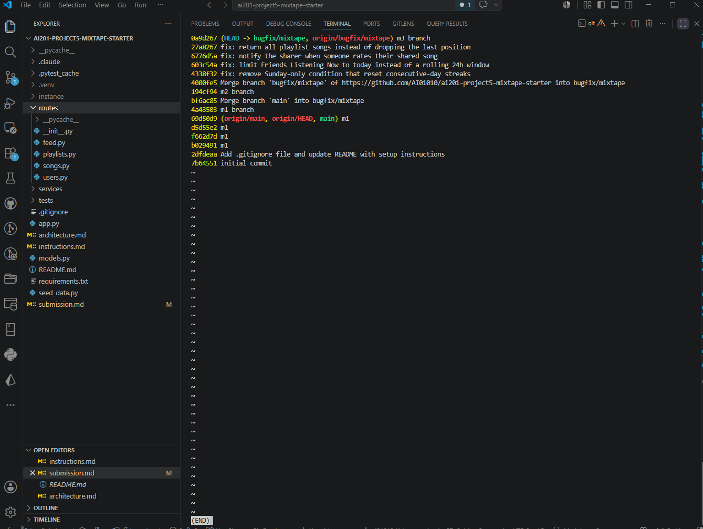

# Project 5 Submission — Mixtape Bug Hunt

## AI Usage

I used Claude Code as my main tool throughout this project, and it did a lot of the
heavy lifting — I want to be upfront about that rather than undersell it. Here is
specifically what it was used for, and the places where its output had to be checked or
turned out to be wrong:

- **Codebase orientation (Milestone 1).** Claude read every file and drafted an
  architecture map for me. Instead of trusting the summary, I had it fact-check its own
  draft against the source, claim by claim — that pass caught eleven wrong or overstated
  statements in its first version. Two examples: it claimed "every route delegates to a
  service function" (`GET /users/<id>` actually queries the model directly in the route),
  and it claimed every model has a `to_dict()` (the `Tag` model doesn't). The corrected
  map became the codebase map below. Lesson learned: AI summaries of code read as
  confident whether or not they're accurate; the verification pass is what made this one
  trustworthy.

- **An AI theory that evidence overturned (Issue #3).** Claude's initial diagnosis of the
  duplicate-search-results issue was plausible: `search_songs` joins the `song_tags`
  table, and a song with three tags comes back as three SQL rows. But when we actually
  ran it — the repo's own `test_search_no_duplicates_multi_tag_song` and a live query —
  each song appeared exactly once: SQLAlchemy's legacy `Query.all()` deduplicates entity
  results, so the row multiplication never reaches the response. The plausible
  explanation was wrong about the visible symptom. That is exactly why this project's
  "reproduce before you fix" rule matters, and why I set Issue #3 aside instead of
  "fixing" something that doesn't manifest.

- **Reproduction and debugging (Milestone 2).** Claude wrote the reproduction scripts I
  describe in each RCA entry: calling `update_listening_streak()` directly with
  controlled Saturday/Sunday dates (the live endpoint can't show a Sunday bug on a
  Wednesday), backdating a `ListeningEvent` to yesterday 11pm to trigger the feed bug,
  and driving the rating and playlist endpoints through Flask's test client. It also
  explained `date.weekday()` numbering (Monday=0, Sunday=6) when I was reading the streak
  condition, and did the side-by-side comparison of `add_to_playlist` vs `rate_song` that
  pinned Issue #4 as a missing step rather than broken logic.

- **Fixes and verification (Milestone 3).** The fixes themselves were small and
  AI-applied, but each one was gated by evidence: regression tests for Issues #2 and #4
  were written *first* and shown failing against the buggy code, then passing after the
  fix; the full suite went from 3 failing to 18 passing; and independent review agents
  then tried to break each diff (all four came back correct — with useful caveats I kept
  in the RCA entries, like the feed's "today" meaning the UTC day). I read every diff
  before committing.

- **Environment help.** The README's `FLASK_APP=app:create_app flask run` is bash syntax
  and fails in PowerShell; Claude gave me the working form (`flask --app app:create_app
  run`) after I hit the error. Along the way it also found a defect that isn't in the
  issue list: `POST /playlists/<id>/songs` crashes with an `IntegrityError` 500 because
  the code appends through a relationship that can't populate the join table's NOT NULL
  `position`/`added_by` columns — documented in my Issue #5 entry because it forced a
  workaround during reproduction.

## Codebase Map

Mixtape is a Flask JSON API with no frontend and no login — every endpoint takes user IDs
directly in the URL or the request body. Data lives in a local SQLite database that
`seed_data.py` fills with 5 users, 13 songs, 3 playlists, and some listening history.

### Main files and what each one does

- **`app.py`** — the app factory. `create_app()` configures SQLite, registers four
  blueprints (`/songs`, `/playlists`, `/users`, `/feed`), and creates the tables. The
  shared `db = SQLAlchemy()` object lives here, which is why every service does
  `from app import db`.
- **`models.py`** — 7 SQLAlchemy models: `User`, `Tag`, `Song`, `ListeningEvent`,
  `Rating`, `Playlist`, and `Notification`, plus 3 plain association tables:
  `friendships`, `song_tags`, and `playlist_entries`. The `playlist_entries` table is the
  interesting one: besides the two IDs it also stores `position`, `added_by`, and
  `added_at`, so songs in a playlist have an explicit order and a record of who added
  them — it is not just a set. `Rating` has a unique constraint on `(user_id, song_id)`,
  so rating a song twice updates your existing rating instead of adding a second row.
  `User` stores `listening_streak` and `last_listened_at` directly on the user row.
- **`routes/`** — one file per blueprint (`songs.py`, `playlists.py`, `users.py`,
  `feed.py`). The routes are thin: they parse the request, call one service function, and
  turn any `ValueError` the service raises into a 400 or 404 JSON error.
- **`services/`** — all the real logic:
  - `streak_service.py` records listening events and updates the streak stored on the user.
  - `feed_service.py` builds "Friends Listening Now" (recent events only, one most-recent
    song per friend) and the activity feed (last 20 events, no recency filter).
  - `search_service.py` searches songs by title or artist with a case-insensitive `ilike`.
  - `notification_service.py` creates and reads notifications, and also contains the two
    actions that can trigger them: `add_to_playlist` and `rate_song`.
  - `playlist_service.py` creates playlists and returns a playlist's songs ordered by
    their `position` in `playlist_entries`.
- **`seed_data.py`** — drops and recreates everything, then seeds the test data.
- **`tests/`** — pytest suites for streaks, search, and playlists (nothing for the feed or
  notifications). They run against an in-memory SQLite database.

### Data flow — a user listens to a song and their streak updates

`POST /songs/<song_id>/listen` in `routes/songs.py` calls
`streak_service.record_listening_event(user_id, song_id)`. That function inserts a
`ListeningEvent` stamped with the current UTC time, then calls
`update_listening_streak(user, now)`, which compares today's date with the date of the
user's `last_listened_at`: listening the same day changes nothing, listening on a
consecutive day increments the streak, and a skipped day resets it to 1. The result is
written straight onto the `User` row in the same commit.

What surprised me is that `GET /users/<user_id>/streak` does no calculation at all — it
just returns the stored integer. The streak is computed entirely at write time, so
whatever the last listen wrote is what every later read shows.

### Data flow — a friend adds your shared song to a playlist and you get notified

`POST /playlists/<playlist_id>/songs` in `routes/playlists.py` calls
`notification_service.add_to_playlist(playlist_id, song_id, added_by)` — notably in the
notification service, not the playlist service. It validates that the song, the adder,
and the playlist all exist, appends the song to `playlist.songs` if it is not already
there, and then, if the person adding is not the person who originally shared the song,
calls `create_notification()` for the sharer with type `song_added_to_playlist` and a
pre-rendered message string. The sharer sees it through
`GET /users/<user_id>/notifications`, which just reads `Notification` rows newest-first.

### Patterns I noticed

- **Thin routes, fat services.** Routes never contain business logic; services raise
  `ValueError` for anything invalid and routes translate that into an error response. The
  one exception is `GET /users/<id>`, which queries the `User` model directly.
- **Write-time denormalization.** The streak is stored on the user instead of being
  recomputed from `ListeningEvent` history, and notification bodies are pre-rendered
  strings. Reads are cheap, but a wrong write sticks around.
- **Every model serializes itself** with a `to_dict()` method (except `Tag`, whose names
  get inlined into `Song.to_dict()`), and list endpoints wrap results with a `count`.
- **The association tables are raw `db.Table`s, not model classes.** The seed script
  inserts into them directly, and `playlist_service` joins `playlist_entries` in its
  query so it can order by `position` — the plain `Playlist.songs` relationship has no
  way to express that ordering.
- **Everything is UUID strings and UTC timestamps**, but SQLite stores datetimes without
  timezone info, so `streak_service` re-attaches UTC to `last_listened_at` before doing
  date math.

## Root Cause Analyses

<!-- One entry per fixed bug, using this template (all 5 fields required):

### Issue #N — <title>

**How I reproduced it** — ...

**How I found the root cause** — ...

**The root cause** — ...

**My fix** — ...

**Side-effect check** — ...
-->

### Issue #1 — My listening streak keeps resetting

**How I reproduced it** — This bug only shows up on the live endpoint on an actual
Sunday (today is a Wednesday), so I reproduced it at the function level instead, the way
the project hints suggest: I called `update_listening_streak()` directly with controlled
dates — a Saturday (2024-06-15), then the following Sunday, then Monday. After Saturday
the streak was 1; after Sunday it was still 1 even though the days are consecutive
(expected 2); after Monday it went to 2, which matches kenji's report of the streak
"counting again" from 1 the day after it got wiped. The condition that triggers it is
simply that the consecutive-day listen lands on a Sunday. The repo's own test
`test_streak_increments_on_sunday` fails on exactly this scenario (`assert 1 == 2`), so
`pytest tests/test_streaks.py` reproduces it too.

**How I found the root cause** — I started from the read side: `GET /users/<user_id>/streak`
calls `get_streak()`, which just returns the stored `user.listening_streak` with no date
math at all. So the wrong number had to be *written*, not misread. The only code that
writes the streak is `record_listening_event()` → `update_listening_streak()` in
`services/streak_service.py`. Reading that function's branches, the increment case stood
out: `elif days_since_last == 1 and today.weekday() != 6:` — nothing else in the function
cares about weekdays, and the bug report was weekday-specific. I checked Python's docs to
be sure: `date.weekday()` numbers Monday as 0 and Sunday as 6. The moment I was confident
was stepping through the function with a Saturday date followed by a Sunday date and
watching control skip the increment and land in the reset branch instead.

**The root cause** — Python's `weekday()` returns 6 for Sunday, and the increment branch
required `today.weekday() != 6`. So a listen on a Sunday — even exactly one day after the
previous listen — failed that condition and fell through to the `else`, which set the
streak back to 1. The function still updated `last_listened_at` afterward, which is why
kenji saw it "counting again": Monday's listen found `days_since_last == 1` (and Monday's
weekday is 0), so it incremented the already-wrecked streak from 1 to 2. A consecutive-day
streak depends only on the gap between calendar days — the day of the week has no business
in that comparison — so the correct condition is `days_since_last == 1` alone.

**My fix** — Removed the `and today.weekday() != 6` clause, leaving
`elif days_since_last == 1:`. One line; no other logic touched.

**Side-effect check** — The change only widens the increment condition, but I still ran
the whole streak suite (5/5 pass) to confirm the neighboring rules survived: a first
listen starts at 1, listening twice in one day doesn't double-count, and a skipped day
still resets to 1. I also stepped a user through Saturday → Sunday → Monday → Monday again
→ a skipped day and got 1, 2, 3, 3, 1 — the streak now crosses the weekend boundary, and
the reset still fires when a day is genuinely missed.

### Issue #2 — Friends Listening Now shows people from yesterday

**How I reproduced it** — The trigger condition is a friend whose most recent listen was
yesterday evening, i.e. less than 24 hours ago but on the previous calendar day. The
seeded events are all stamped at seed time, so I inserted one extra `ListeningEvent` for
aaliya timestamped yesterday at 23:00 UTC and then requested
`GET /feed/<kenji_id>/listening-now` (kenji and aaliya are friends). At 07:27 UTC today,
aaliya appeared in kenji's "listening now" feed with the yesterday-23:00 timestamp —
exactly nova's complaint that a friend who last listened the previous evening still hangs
around the feed the next morning.

**How I found the root cause** — From `routes/feed.py` into
`feed_service.get_friends_listening_now()`. The recency filter is
`ListeningEvent.listened_at >= cutoff` with
`cutoff = datetime.now(timezone.utc) - RECENT_THRESHOLD`, where `RECENT_THRESHOLD` is a
module constant equal to 24 hours. The giveaway was in nova's own report: stale entries
disappear "at the same time the next day". That is the fingerprint of a window that slides
with the query time instead of resetting at midnight. My inserted yesterday-23:00 event
passing the filter at 07:27 UTC confirmed it — the event was only 8.5 hours old, so it was
inside the 24-hour window, just on the wrong calendar day.

**The root cause** — The feature's contract is "friends who have listened today", but the
code implemented "friends who listened in the last 24 hours". `now - 24h` never aligns
with a day boundary, so an 11pm listen stays visible until 11pm the following day — all
morning, even though the friend hasn't opened the app. Correct behavior requires a fixed
boundary (the start of the current day), not a distance measured from whenever you happen
to ask.

**My fix** — Replaced the cutoff with the start of the current UTC day:
`datetime.now(timezone.utc).replace(hour=0, minute=0, second=0, microsecond=0)`, deleted
the now-unused `RECENT_THRESHOLD` constant and `timedelta` import, and updated the
docstring from "recently" to "today". One semantic decision worth recording: "today" means
the UTC day, consistent with every timestamp this app stores.

**Side-effect check** — The constant was used in exactly one place; `get_activity_feed()`
has no recency filter at all, and after the fix I verified the activity feed still returns
yesterday's events, because "not filtered by recency" is that function's documented
behavior — that's the code path most plausibly affected by a change in this file, and it
isn't. The per-friend dedup logic is untouched. My regression tests cover both sides of
the boundary: a listen at 00:01 today appears, a listen at 23:00 yesterday does not
(`tests/test_feed.py`). Full suite passes 18/18.

### Issue #4 — Notified on playlist add but not on rating

**How I reproduced it** — With fresh seed data, nova has exactly one notification (the
seeded `song_added_to_playlist` one). I had kenji rate nova's shared song "Midnight
Drive" via `POST /songs/<song_id>/rate` with `{"user_id": <kenji_id>, "score": 5}` — it
returned 201 and the rating was saved. Then `GET /users/<nova_id>/notifications` still
returned only the one playlist-add notification: no notification of type `song_rated`
exists anywhere. So the rating persists (matching "it shows on the song") but no
notification is ever created, for any rater — the omission is unconditional, which
matches aaliya saying it happens "for anyone I've asked."

**How I found the root cause** — The issue report hands you a working feature to compare
against, so I put the two flows side by side — they both live in
`services/notification_service.py`. `add_to_playlist()` ends by calling
`create_notification(user_id=song.shared_by, ...)`, guarded by
`song.shared_by != added_by_user_id`. `rate_song()` validates the score, upserts the
`Rating` row, commits… and returns. No `create_notification` call — it never even reads
`song.shared_by`. To rule out the other explanation (notifications created but not shown),
I read `get_notifications()`: it filters only by `user_id` and the `read` flag, so there
is no type filter that could hide rating notifications. I also searched the repo for any
other place that constructs a `Notification`; there is none besides `create_notification`
itself. That closed the case: nothing creates them, nothing could.

**The root cause** — A missing step rather than broken logic: the notification half of
rating was never implemented. The route → `rate_song()` path stores the rating and stops.
Since `create_notification` is the only way notifications come into existence and
`rate_song` never calls it, "rating notifications just don't happen, for anyone" is
exactly what the code guarantees. This is the architectural cause the hint pointed at: the
working feature bundles "do the action, then notify the sharer" in one service function,
and the rating action only ever got the first half.

**My fix** — Added the same pattern `add_to_playlist` uses, right after the rating
commit: if `song.shared_by != user_id`, call `create_notification()` with type
`song_rated` and a body like `kenji rated your song 'Midnight Drive' 5/5.` The guard means
you are not notified for rating your own song, mirroring the playlist-add behavior.

**Side-effect check** — New tests in `tests/test_notifications.py` pin the behavior: the
sharer receives the notification, a self-rating produces none, and the rating itself still
persists with the right score. Through the endpoint I confirmed the untouched validation
still rejects out-of-range scores with a 400, `mark_as_read` still works, and re-rating
updates the existing row (the unique-constraint path) while notifying again — consistent
with how playlist re-adds behave. I did not touch `add_to_playlist`, and the seeded
playlist-add notification still reads back correctly.

### Issue #5 — The last song in a playlist never shows up

**How I reproduced it** — Fresh seed data puts 7 songs into "Friday Energy" (7 rows in
`playlist_entries`), but `GET /playlists/<id>/songs` returns `count: 6`. The missing song
is "Harlem Renaissance" — the entry with the highest `position`. To confirm darius's
observation that adding a song "frees" the previously hidden one, I inserted "Still
Waters" at position 8 and re-fetched: the count became 7, "Harlem Renaissance" appeared,
and "Still Waters" — now the most recently added song — became the hidden one. The
playlist tests fail on the same behavior (`test_playlist_returns_all_songs` expects 5
songs and gets 4). One honest caveat: I had to insert the new row directly into the
database, because `POST /playlists/<id>/songs` currently crashes with a 500
(`IntegrityError`: `playlist_entries.position` is NOT NULL) — that is a separate defect
from this issue, so reproducing "the last song is hidden" required bypassing it.

**How I found the root cause** — From `GET /playlists/<id>/songs` in
`routes/playlists.py` into `playlist_service.get_playlist_songs()`. The query itself
looked right: join `playlist_entries`, filter by playlist ID, order by `asc(position)`.
Then the return line: `return [song.to_dict() for song in songs[:-1]]`. The `[:-1]` slices
off the last element of a list that was just sorted by position — and the docstring a few
lines above says "This function returns all songs in the playlist," so the code
contradicts its own contract. What made me certain rather than just suspicious: the
database had 7 rows for "Friday Energy", the endpoint returned 6, and the missing song was
precisely the highest-position entry — the one element `[:-1]` on an ascending list is
guaranteed to drop.

**The root cause** — The song list is ordered by ascending `position`, and positions are
assigned incrementally as songs are added, so the final element is always the most
recently added song. `songs[:-1]` therefore always hides exactly that one. It also
explains darius's "freeing" observation: adding a song at position N+1 means the old
position-N entry is no longer last, so it reappears — and the new song takes its place as
the hidden one.

**My fix** — Removed the slice: `return [song.to_dict() for song in songs]`.

**Side-effect check** — All three playlist tests pass, including the empty-playlist case,
which is worth calling out: `[][:-1]` is also `[]`, so empty playlists behaved correctly
even with the bug, and the fix keeps that path identical. After reseeding I fetched the
endpoint again: all 7 songs, still in position order, first song unchanged. I also checked
that nothing else calls `get_playlist_songs`, so no other feature could have been relying
on the truncated list.

### Issue #3 — The same song shows up twice in search (could not reproduce)

I made a genuine attempt at this one before setting it aside. `GET /songs/search?q=Anthem`
returns "Crown Heights Anthem" exactly once, even though that song has 3 tags and the
issue report says it appeared three times. A broad query matching all 13 seeded songs
returned no duplicated titles at all, and the repo's own
`test_search_no_duplicates_multi_tag_song` passes against the current code. Following the
project guidance ("if you can't reproduce it, you don't understand what's wrong yet ...
try a different one"), I chose issues #1, #2, #4, and #5 instead. I may revisit this as a
stretch goal to explain *why* the reported symptom doesn't manifest.

## Stretch: Regression Tests

I wrote regression tests for the two fixed issues that had no existing coverage, and ran
them before and after the fix to prove they catch the bug:

- `tests/test_feed.py::test_friend_from_yesterday_evening_does_not_appear` (Issue #2) —
  seeds a friend whose only listen is yesterday at 23:00 UTC and asserts the "listening
  now" feed is empty. Against the buggy code this **fails**, because a yesterday-evening
  listen is less than 24 hours old and passed the rolling-window filter; after the fix it
  passes. A companion test asserts a listen at 00:01 today *does* appear, so the fix
  can't silently over-filter.
- `tests/test_notifications.py::test_rating_notifies_the_sharer` (Issue #4) — has one
  user rate another user's shared song and asserts a `song_rated` notification exists for
  the sharer. Against the buggy code this **fails** (no notification was ever created);
  after the fix it passes. Companion tests pin the guard (no self-notification) and that
  the rating itself still saves.

Issues #1 and #5 already had tests that would have caught them
(`test_streak_increments_on_sunday` and the two playlist tests) — those failed before my
fixes and pass now.

## Git Log

One commit per bug fix on `bugfix/mixtape`, in conventional commit format:

